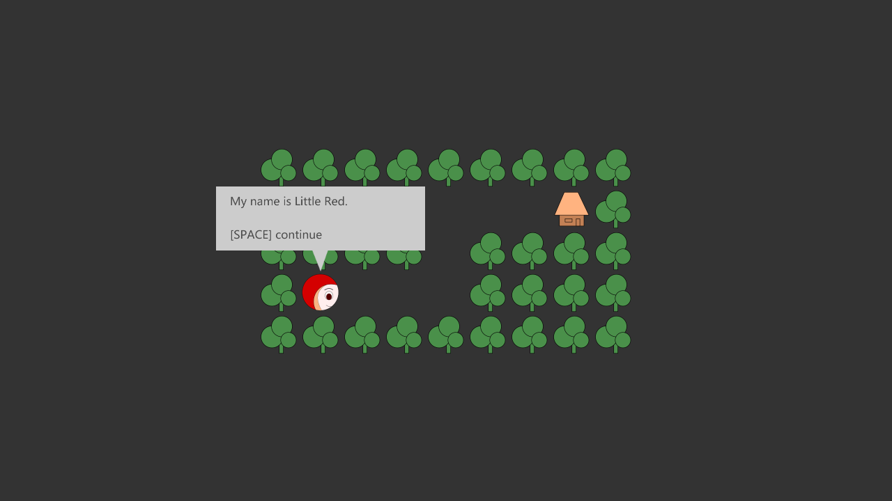
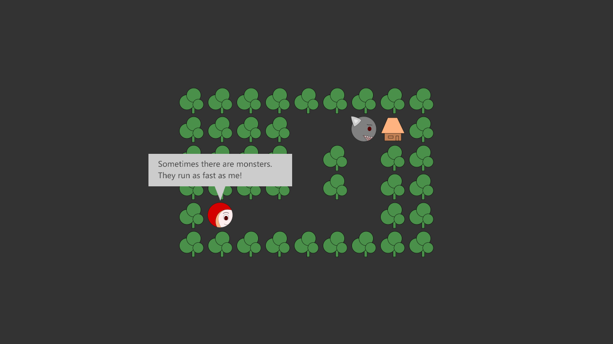
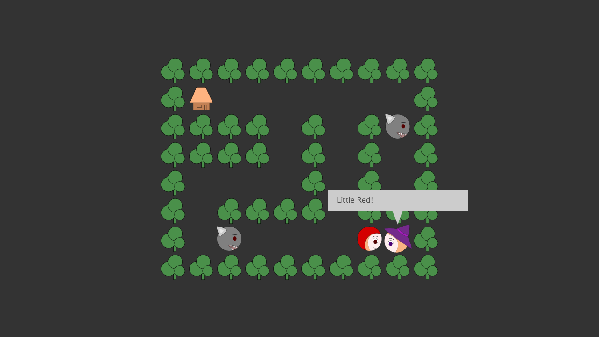
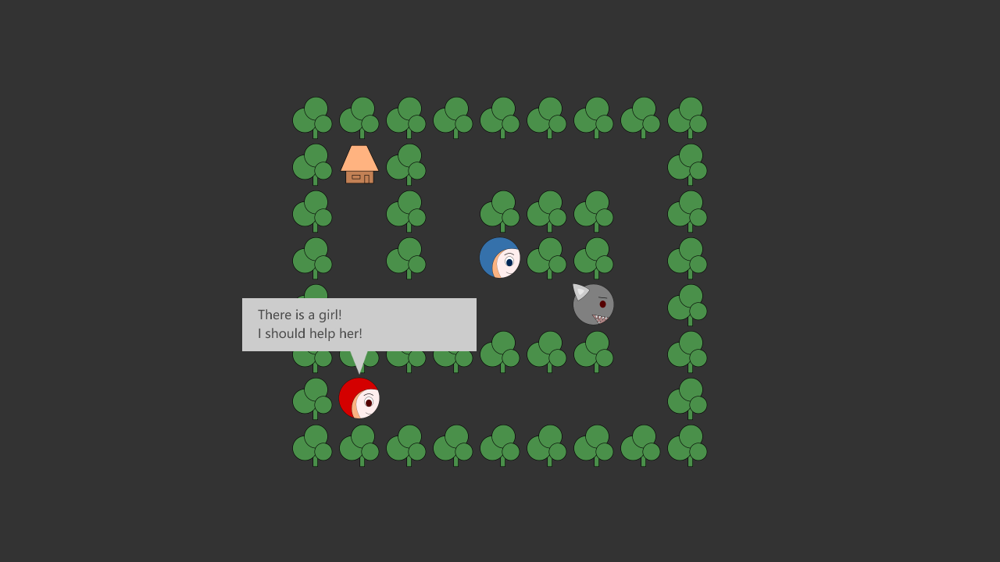

# Little Red

A storytelling puzzle game for [Ludum Dare 43](https://ldjam.com/events/ludum-dare/43) compo, telling a story about magic and sacrifices.

## Introduction

Control *Little Red*, the main character, to go cross dangerous forest. Meet different characters, learn magic, and complete the story.

It is a story-driven game. There are two different endings, based on your choices.

There are about 10 puzzles. The difficulty is also influenced by your choices.

## Controls

This game requires keyboard and mouse.

* [SPACE] continue messages
* [1] [2] make choices
* [W] [A] [S] [D] or arrow keys for map moving
* [Enter] stay on the same block (no moving)
* [R] restart current level
* mouse click for some skills

## How to Play

[https://github.lastleaf.me/ludum-dare-43/](https://github.lastleaf.me/ludum-dare-43/)

This HTML5 game requires WebGL support. Please play with latest Chrome or Firefox.

## Screenshots

## Tools Used in this Game

Tools:

* Inkscape (image creation)
* LMMS (audio creation)
* Atom (programing)
* Rust, emscripten, and nodejs toolchain

This game is mostly written in Rust and my half-done framework [glayout](https://github.com/LastLeaf/glayout).

## CREDIT

This game is made by LastLeaf (Boquan Fu), for Ludum Dare 43.

## LISENCE

The content of this game is under [Creative Commons Attribution-ShareAlike 4.0 International](https://creativecommons.org/licenses/by-sa/4.0/). The software of this game is under [MIT LICENSE](https://opensource.org/licenses/mit-license.html).
